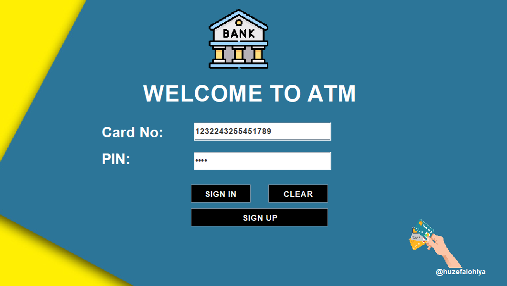
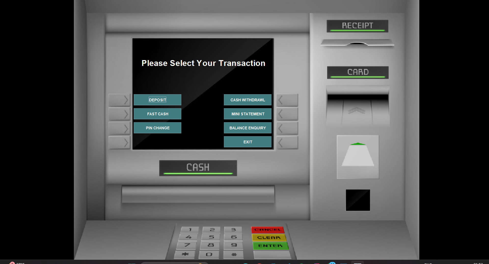
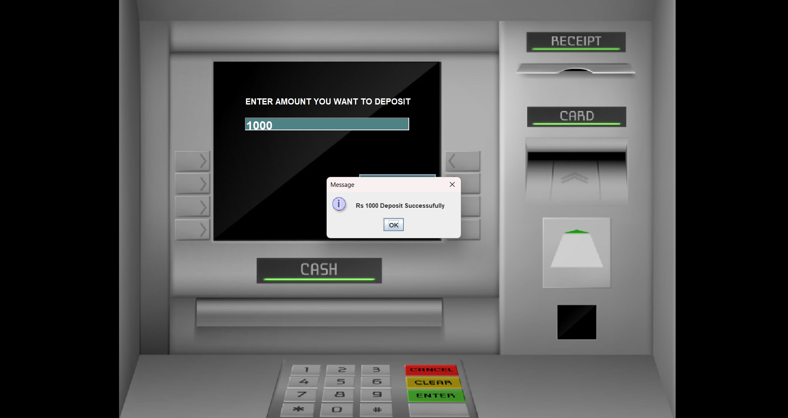

# Banking Management System

[](https://www.java.com/) 
[](https://www.mysql.com/) 
[](https://docs.oracle.com/javase/8/docs/technotes/guides/swing/) 

A **desktop banking application** built using **Java Swing** and **MySQL**. This system allows users to perform typical ATM operations with secure login and database-backed storage. It demonstrates **Java GUI development, JDBC connectivity, and object-oriented programming**.

---

## **Features**

- **User Authentication:** Login using card number and PIN.  
- **ATM Operations:**  
  - Deposit money  
  - Withdraw money  
  - Check account balance  
  - Fast cash options  
  - Mini statement  
  - PIN change  
- **Account Management:**  
  - New user registration with three-step signup forms  
  - Card number and PIN generated for new users  
- **Data Persistence:** All user and transaction details are stored in a **MySQL database**.  
- **Exit Option:** Safely log out and exit the application.  

---

## **Technologies Used**

- **Java** (Swing for GUI)  
- **MySQL** (Database)  
- **JDBC** (Java Database Connectivity)  
- **IntelliJ IDEA** (IDE)

  ## Screenshots

### Login Screen


### ATM Dashboard


### Deposit Money



---

## **Installation / How to Run**

1. Clone the repository:  
   ```bash
   git clone https://github.com/YourUsername/BankingManagementSystem.git


